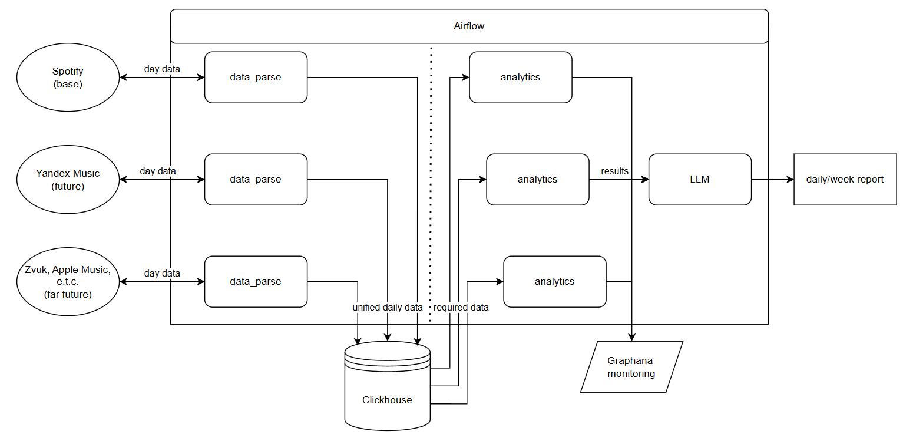

# Daily Music Chart Analytics System 
A system for monitoring and analyzing chart trends with a ETL pipeline.

------
### Stack:
- Airflow
- Clickhouse
- Docker

### Sources:
- Spotify
- Yandex Music (planned)

------
Early pipeline architecture:
